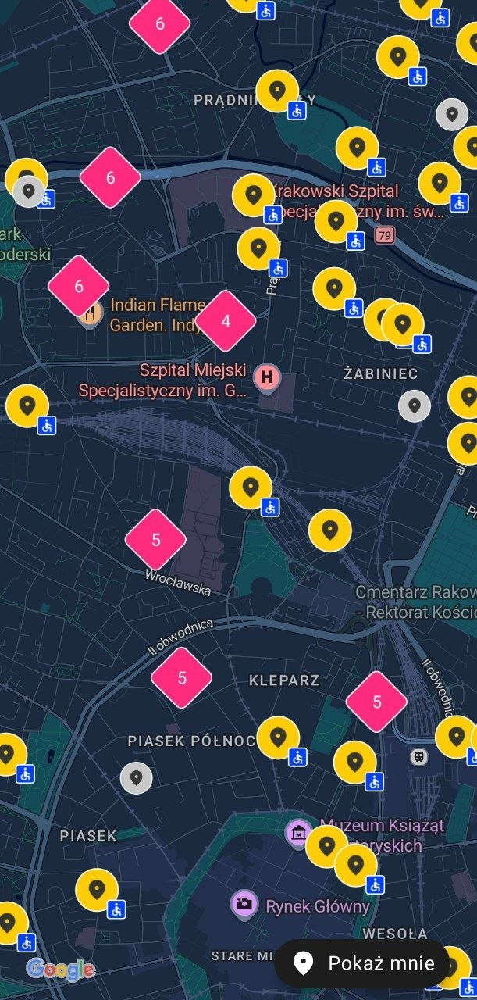
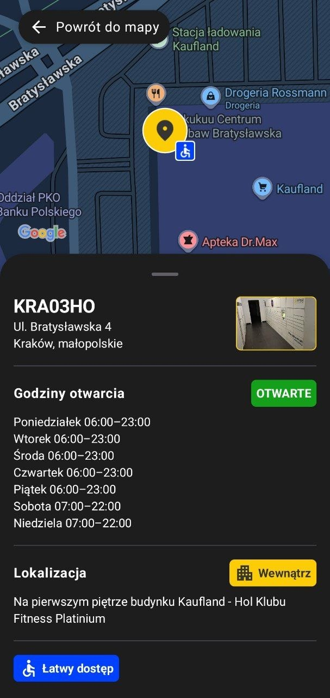

# InPost Map (Mapa InPost)

## Author

- **Name:** Illia Bilyi
- **Email:** ilyadreamix@gmail.com

## Overview

InPost Map is an Android application which can help you find the nearest [InPost](https://inpost.pl) parcel locker and its information on the map in Poland.

## Demo & Description

### Map demo video (YouTube)

[](https://www.youtube.com/watch?v=ogxqoG9jhaY)

### Features

#### The map itself (screenshot below)

The Map is the main screen of the app. It allows users to find **parcel lockers** simply by moving the camera. The pins closest to the center of the screen load automatically.

To make the map easier to read, I've implemented different icon styles:

- **Status:** Currently closed parcel lockers are smaller and colored grey.
- **Accessibility:** An "Easy Access" icon appears next to lockers located in areas specifically designed for people with special needs.
- **Clustering:** To avoid clutter, multiple nearby lockers are grouped into a single cluster icon showing the total count. Users can expand these clusters to pick a specific locker.

The map also assists with navigation and provides feedback:

- **Smart Zoom:** If the user is zoomed out too far, the app suggests zooming in for better visibility.
- **Error Handling:** The app will notify the user if there is an issue loading the data.
- **Current Location:** Users can tap a dedicated button to jump to their current position.

When you tap a parcel locker icon, the app switches into what I call **"focus mode"**. In this mode, you can view detailed information about the location. Read more about this mode below.



#### Focus mode (screenshot below)

Focus mode is a state where the app displays detailed information about a specific parcel locker. You can enter this mode by tapping any locker icon on the map.

In Focus Mode, the app provides following details:

- The locker's code name and full address.
- A photo of the location and its operating hours.
- Current status (whether it's open or closed).
- Location specifics (whether it's located indoors or outdoors) and helpful directions on how to find it.

Additionally, for relevant locations, I display the "Easy Access" badge to highlight accessible spots.



## Technologies

To build this experience, I used a modern Android stack:

- **Android SDK**
- **Language:** Kotlin
- **UI Framework:** Jetpack Compose with Material 3
- **Dependency Injection:** Koin
- **Networking:** Ktor with OkHttp engine
- **Maps:** Google Maps Compose & Utils (for clustering and markers)
- **Image Loading:** Coil

## How to run

### Prerequisites

> [!WARNING]
> Please read the whole section.

#### System requirements

- **OpenJDK 21**
- **Android SDK 37**
- **Android Debug Bridge** (or command line tools)

#### Build configuration

If you want to build the APK yourself, you **must** fill in some additional data in your `local.properties` file. I've provided a template called `local.properties.template`. You can copy the keys from there along with the comments. Please make sure to replace the placeholders (including the `<` and `>` symbols) with your actual data.

I've set it up this way so I don't accidentally leak my own API keys to the web. If you can't provide your own keys, you can always use the pre-built production release and run it on an emulator or a physical device, just grab it from the [Releases](https://github.com/ilyadreamix/inpost-internship-task/releases/tag/0.0.1) page.

**Android SDK path:**

`sdk.dir=<PASTE SDK PATH HERE>`

**Google Maps API Key:**

`app.google.maps.key=<PASTE KEY HERE>`

**Development Signing Configuration:**

(Provide the absolute path to your `.jks` file, the store password, key alias, and key password)

`app.signing.development.store.file=<PASTE ABSOLUTE PATH HERE>`

`app.signing.development.store.password=<PASTE JKS PASSWORD>`

`app.signing.development.key.alias=<PASTE KEY ALIAS>`

`app.signing.development.key.password=<PASTE KEY PASSWORD>`

**Production Signing Configuration:**

(For testing purposes, you can duplicate your development values here)

`app.signing.production.store.file=<PASTE ABSOLUTE PATH HERE>`

`app.signing.production.store.password=<PASTE JKS PASSWORD>`

`app.signing.production.key.alias=<PASTE KEY ALIAS>`

`app.signing.production.key.password=<PASTE KEY PASSWORD>`

### Build & run

```bash
git clone https://github.com/ilyadreamix/inpost-internship-task.git
cd ./inpost-internship-task
./gradlew app:assembleDevelopmentRelease
adb install ./app/build/outputs/apk/development/release/app-development-release.apk
adb shell am start -n io.github.ilyadreamix.inpostinternshiptask.development/io.github.ilyadreamix.inpostinternshiptask.InPostInternshipTaskActivity
```

## What I would do with more time?

If I had more time, the first thing I'd do is implement a **filtering system** for parcel lockers: status (active/inactive), specific time slots, and "Easy Access" availability. I'd also love to add a **search-by-address** feature, similar to how Google Maps allows you to find locations near a specific building or street. Additionally, since the app currently focuses on Poland and is only available in Polish, I would add **localization and country settings** to make it more universal.

Regarding technical improvements, I would **rewrite the Google Maps implementation using the traditional View-based approach**. The Google Maps SDK for Jetpack Compose is still relatively young and suffers from optimization issues and missing features. I spent a significant amount of time optimizing map movement and marker rendering, specifically using the **Canvas API** and animating only visible markers, but it's still not perfect. If you're curious about the details, I invite you to check out the code and comments in `presentation/points/map/composables` (entry point: `PointsMapScreen.kt`). Based on my research, the View-based version is much more responsive since the Compose SDK is essentially just a wrapper.

Finally, I'd focus on the visual details. I would love to fully implement InPost's signature **pixel-style branding** throughout the entire app. Adding those specific design elements would make the user experience feel much more authentic and polished.

## AI usage

In this project, I utilized AI tools (Claude and Gemini) for specific parts of the development process. Their involvement was focused on:

- **Data Modeling:** Generating Kotlin data classes that mirror the structure of JSON server responses, which helped speed up the boilerplate work.
- **Mathematical Logic:** Assisting with complex calculations in the UI layer. For instance, in `presentation/points/map/composables/PointsMapScreen.kt`, AI helped refine the `LaunchedEffect` for tracking the bottom sheet state and the logic within the `calculateScreenMapContentPadding` function.

On top of that, I also used AI to help me structure and polish this README.

Apart from these specific assists, I wrote the rest of the code myself to make sure I really understood and controlled how everything in the app works.

## Anything else?

I'd also like to mention that I used my own library in this project, called [**Swiss Knife**](https://github.com/ilyadreamix/swiss-knife). It's a relatively new project where I plan to collect all the utilities I use in my daily development.

For this specific app, I used the `dialogs` module, which features a custom implementation of Bottom Sheets and Alerts. What's cool about it is that it's built with **Kotlin Multiplatform**, so it's available for iOS as well.

You can check it out [here](https://github.com/ilyadreamix/swiss-knife).
